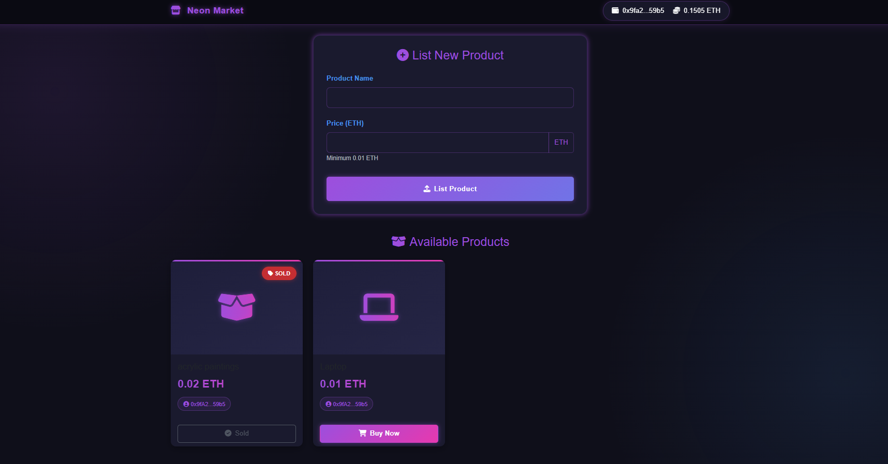

# Decentralized marketplace

A dark-themed NFT/decentralised  marketplace with vibrant neon aesthetics featuring rich purple, blue, and magenta colors. Built with Web3.js for Ethereum transactions.

 

## ✨ Features

- Dark neon UI with glowing elements
- Web3 integration for Ethereum transactions
- Product listing functionality
- Responsive design
- Animated UI components
- Wallet connection (MetaMask)

## 🛠 Technologies

- Frontend: HTML5, CSS3, JavaScript
- Web3: Web3.js, MetaMask
- UI: Bootstrap 5, Font Awesome
- Design: Custom neon aesthetic with CSS gradients

## 🖥 Local Setup

1. Clone repository:
   bash
   git clone https://github.com/YOUR-USERNAME/neon-marketplace.git
   cd neon-marketplace

2.Install live server (if needed):
    bash
  npm install -g live-server
  
3.Start development server:
  bash
  live-server --port=3000
